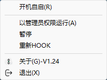
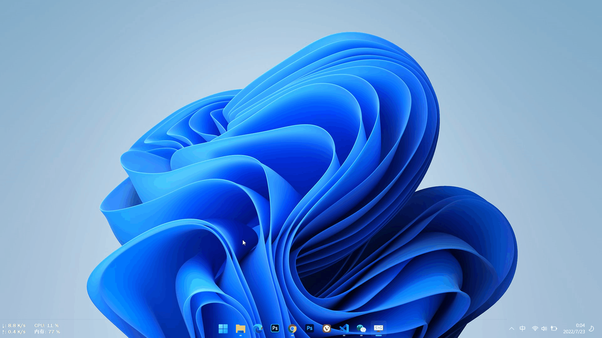

# ScrollSound 简介

 

**ScrollSound**是一个可以让你在任务栏空白处用滚轮控制音量的小工具。一个看似鸡肋用了却离不开的小功能。 
目前支持win10、win11。 

## ✨相关链接：
**下载：** 
[Github](https://github.com/SWDaby/ScrollSound/releases/latest) 
[Gitee](https://gitee.com/swdaby/ScrollSound/releases/) 
[阿里云盘](https://www.aliyundrive.com/s/TBGXFokBRB3) 提取码：`bg1m` 

**依赖环境：** 
[最新支持的 Visual C++ 可再发行程序包下载 | Microsoft Docs](https://docs.microsoft.com/zh-CN/cpp/windows/latest-supported-vc-redist?view=msvc-170) 
如果程序启动时提示找不到dll文件，请下载并安装Microsoft Visual C++ 运行环境。 

本工具使用了TrafficMonitor项目里的一些类，点击围观[大佬](https://github.com/zhongyang219/TrafficMonitor) 

本项目[图标资源](https://www.flaticon.com/) 

## ✨使用

双击打开，将鼠标移至任务栏空白处，滚动滚轮或按下滚轮即可调节音量大小或静音。

为什么要用？为了优雅。

## 截图

托盘菜单：

## 已知问题：

🔴Win11多屏不能使用。(未解决❌) 
🔴不能降权，需重启应用才能降权。(不影响使用，未解决❌) 

